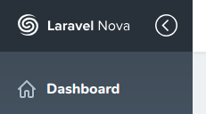

# Collapsible sidebar for laravel nova

This package provide you with a collapsible sidebar for the laravel nova admin panel.



## Installation

```bash
composer require ebess/nova-collapsible-sidebar
```

In order to extend the default sidebar you need to export the layout of nova. 

```php
php artisan nova:publish
```

In `resources/views/vendor/nova/layout.blade.php` you will find the sidebar which looks something like this. 

```html
<!-- Sidebar -->
<div class="min-h-screen flex-none pt-header min-h-screen w-sidebar bg-grad-sidebar px-6">
    <a href="{{ Nova::path() }}">
        <div class="absolute pin-t pin-l pin-r bg-logo flex items-center w-sidebar h-header px-6 text-white">
           @include('nova::partials.logo')
        </div>
    </a>

    @foreach (Nova::availableTools(request()) as $tool)
        {!! $tool->renderNavigation() !!}
    @endforeach
</div>
```

Replace the ordinary `div` tag by `collapsible-sidebar`.

```html
<collapsible-sidebar class="min-h-screen flex-none pt-header min-h-screen w-sidebar bg-grad-sidebar px-6">
    <!-- -->
</collapsible-sidebar>
```

That's it! Now you can toggle the sidebar by clicking the icon. **By default you can use `Esc` to toggle it as well.** 

Also there are several other options you can configure.

Will save the collapsed status to local storage:
```html
<collapsible-sidebar class="..." persist>    
    <!-- -->
</collapsible-sidebar>
```

Now you can toggle it by pressing `F2` instead of `Esc`:
```html
<collapsible-sidebar class="..." toggle-key-code="F2">    
    <!-- -->
</collapsible-sidebar>
```


